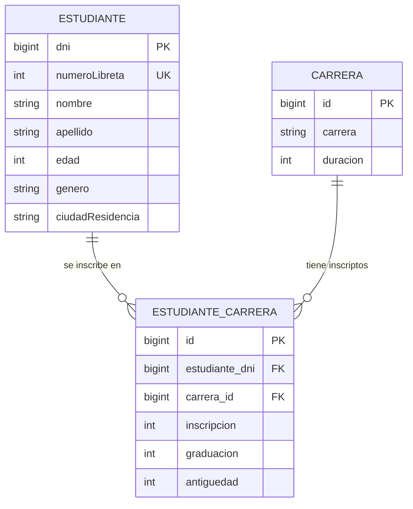

# Modelo de datos — TP2

Diagrama entidad-relación del TP2 (JPA/Hibernate → MySQL `integrador2`).

## Notas

- **Claves primarias** (`dni`, `id`, `id`) son asignadas por la aplicación (sin auto-generación), ya que los valores provienen de los CSV.
- **`EstudianteCarrera`** es la entidad asociativa que resuelve la relación **N:N** entre `Estudiante` y `Carrera`, y agrega atributos propios de la inscripción.
- **Cardinalidades**: un estudiante puede tener 0..N matrículas; una carrera puede tener 0..N inscriptos; cada matrícula corresponde a exactamente 1 estudiante y 1 carrera.
- `Estudiante.ciudadResidencia`, `Carrera.carrera` y `Carrera.duracion` son **NOT NULL**.
- `Estudiante.numeroLibreta` tiene restricción **UNIQUE**.
- Los FK de la asociativa (`estudiante_dni`, `carrera_id`) son **obligatorios** en la aplicación (una matrícula sin estudiante o sin carrera no es válida).
- `EstudianteCarrera.graduacion = 0` significa **en curso** (aún no graduado).
