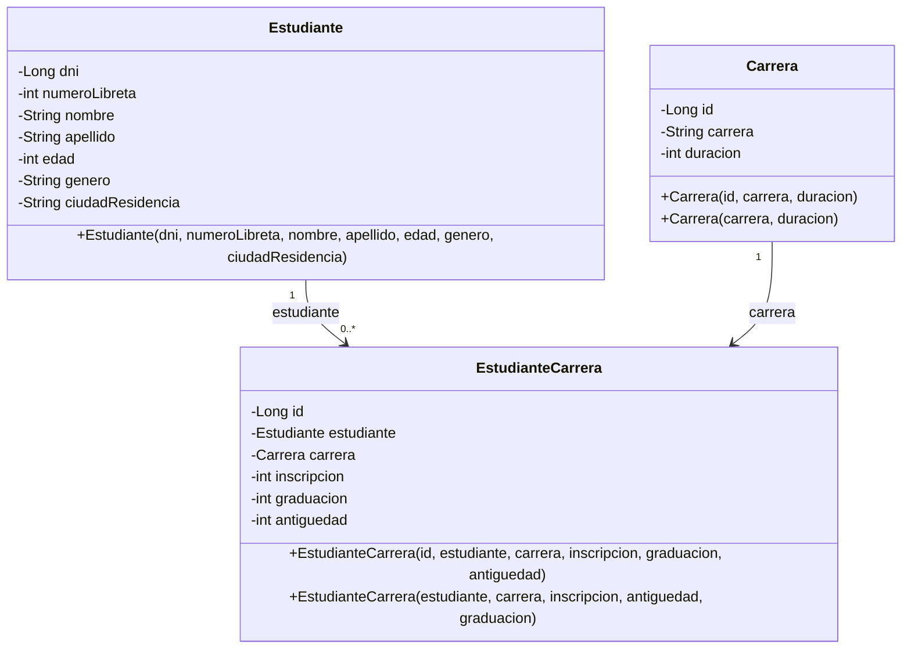

# Diagrama de objetos — TP2

Diagrama de clases/estructura de objetos del TP2: los tres tipos con sus atributos y tipos Java, y las relaciones según las anotaciones JPA. A diferencia del DER (que muestra el nivel físico MySQL con tipos y claves), este diagrama muestra el modelo de objetos de la aplicación. Los valores de instancia concretos (datos de los CSV) no se representan acá.

## Notas

- **Cardinalidades**: 1 estudiante → 0..* matrículas; 1 carrera → 0..* inscriptos; cada matrícula → exactamente 1 estudiante y 1 carrera (derivable de `@OneToMany(mappedBy)` + `@ManyToOne`).
- **`EstudianteCarrera`** es la entidad asociativa de la relación N:N Estudiante–Carrera; sus atributos (`inscripcion`, `graduacion`, `antiguedad`) son los datos propios de la inscripción.
- Atributos visibles como `private` (los accesos son vía Lombok `@Getter`).
- Las colecciones `inscripciones` del lado inverso (`mappedBy`) no se dibujan: están representadas por los enlaces.
- `graduacion = 0` significa **en curso** (convención de datos de los CSV).
- Todos los atributos son de tipo primitivo/objeto Java (`Long`, `int`, `String`); los tipos físicos (`bigint`, `int`, `varchar`) están en el [DER](DER.md).
